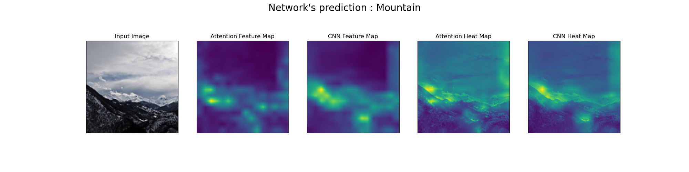
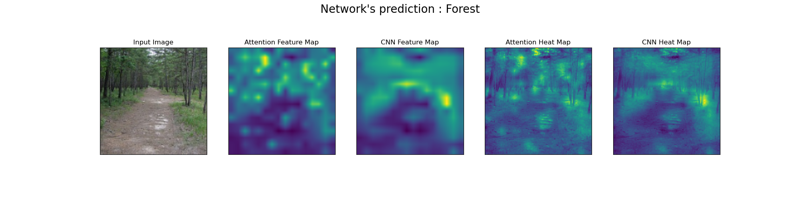
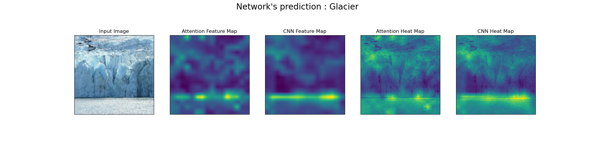
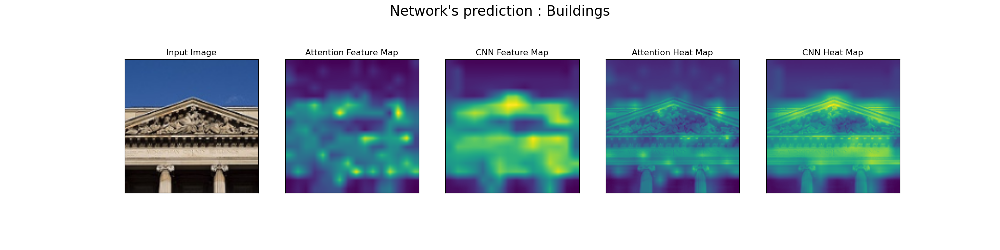

# Visualizing the Attention Mechanism in CNN

## Introduction
The attention mechanism has gained an immense popularity in the deep learning community over the years. There are many variants of it and different way of implementing it. Fundamentally, the idea of attention mechanism is to allow the network to focus on the 'important' parts of the input while ignoring the not so 'important' parts. This produces a better accuracy overall. 

In this experiment, I have implemented a very simple attention mechanism in a traditional CNN model. The idea here is to extract the 'important' parts from the final feature vector produced by the final layer of convolution filters using the attention mechanism. 

## How it works?

The simplest attention mechanism works by taking the output of one of the hidden layer as its input and transforms it with a weight and bias of the same dimension. This result is then multiplied with a vector (element-wise) and converted to numbers between 0 to 1 either by Softmax operation or Sigmoid operation depending on the use case. This is known as Soft-Attention. This output is then multiplied element-wise with the output of the hidden layer (the input to the attention mechanism) and the result is carried over to the rest of the network parts. 

The intuition here is that the output from the attention mechanism acts as a masking vector (or matrix) to mask out the not so 'important' details in the given input. 

**Note** : It is hard to point out what are the 'important' parts in a feature vector as it can not  be easily interpreted by us. However, the network always uses the resources it has to achieve its objective. Hence, it is sensible to assume that the network would focus on the parts that allows it to achieve a lower loss.

## How to Use
To retrain the model with your own dataset, place the folder with dataset in the root folder. Inside the dataset folder, there must be 2 subfolders ('train' and 'test') where each of those folders have subfolders (with their classnames as the folder name) and appropriate images in each of them. As for visualization, just place a folder containing the desired images in the root folder.

To start the training : 
``` python train_script.py --data_folder [NAME OF YOUR DATASET FOLDER] --num_classes [NUMBER OF CLASSES IN YOUR DATASET] --img_size [DESIRED IMAGE SIZE FOR TRAINING] ```

There are other arguments that can be optionally supplied as well. Run ``` python train_script -h ```  to know more.

After the training is done, to visualize the filters : 
``` python visualize.py --data_folder [FOLDER WHERE THE IMAGES ARE LOCATED] ```

The output images will be written to a folder called `output` in the root folder.

## Visualization 
I used the dataset available [here](https://www.kaggle.com/puneet6060/intel-image-classification) to train the CNN model with the attention mechanism. This dataset contains images from 6 classes, namely **buildings**, **forest**, **glacier**, **mountain**, **sea**, and **street**.  The model has achieved an accuracy of 99.8% in the test data. 

To visualize the final filters before and after applying the attention mechanism, I have merged all the filters together as one filter to get an idea on what are the features the network is looking for in the given input image to classify it to a class.

### Examples






## Conclusion
As can be seen the in previous section's examples, the attention mechanism focuses only on the certain part of the feature maps that helps with achieving a lower loss. Keep in mind that this is a very simple attention mechanism and this was implemented purely for learning purposes. Refer to this [paper](https://arxiv.org/abs/1804.02391) to know more about the attention mechanism in detail.


License
----

MIT

